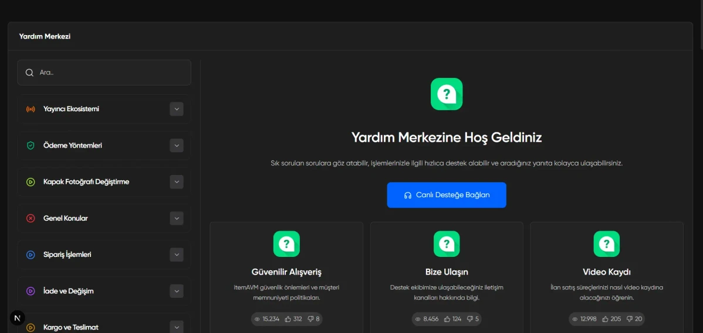

# help-center-app

Next.js 16+ • Tailwind CSS v4 • TypeScript • App Router

---

[See The Project]()

---



---

Modern web standartlarına uygun, performans odaklı ve ölçeklenebilir bir **Yardım Merkezi (Help Center)** uygulaması olarak geliştirilmiştir. Uygulama, dökümanda belirtilen tüm fonksiyonel gereksinimleri (Hash-routing, Deep linking, Dinamik arama) karşılayan mimari bir çalışmadır.

### 🚀 Özellikler

- **Hash-Based URL Yönlendirme (Madde 3.2):** Makale detayları `/yardim-merkezi#makale-slug` yapısıyla yönetilir. Tarayıcı geçmişi (Geri/İleri) ile tam uyumlu çalışır.
- **Dinamik Arama Motoru (Madde 3.3):** Arama çubuğuna yazılan metin ile hem sol kategori menüsü (Sidebar) hem de ana içerik alanı anlık olarak filtrelenir.
- **Akıllı Sidebar Senkronizasyonu (Madde 3.4):** Bir makale seçildiğinde veya derin linkle giriş yapıldığında, ilgili kategori (Accordion) otomatik olarak tespit edilerek genişletilir ve aktif makale vurgulanır.
- **Derived State (Türetilmiş Durum) Yönetimi:** Sidebar ve filtreleme mantığında gereksiz `useEffect` kullanımından kaçınılarak, React'in en güncel performans standartlarına uygun "Türetilmiş Durum" mimarisi kullanılmıştır.
- **Modüler Bileşen Mimarisi:** Proje; `layout`, `ui`, `home` ve `detail` olarak klasörlenmiş, atomik tasarım prensiplerine uygun, tekrar kullanılabilir bileşenlerden oluşur.
- **Pixel-Perfect Styling:** Figma tasarımındaki milimetrik ölçüler, Tailwind CSS v4'ün yeni tema motoru (`@theme`) kullanılarak birebir koda dökülmüştür.
- **Merkezi Veri Yönetimi (Madde 3.1):** Tüm kategori ve makale içerikleri `data/helpCenter.json` dosyası üzerinden dinamik olarak beslenir.

### 🛠️ Teknoloji Yığını

- **Framework:** Next.js 16+ (App Router)
- **Dil:** TypeScript (Strict Type Checking)
- **Styling:** Tailwind CSS v4 (Modern CSS-first approach)
- **İkon Seti:** Lucide React
- **Font:** Gilroy (Local Font Integration)
- **Yardımcı Kütüphaneler:** clsx, tailwind-merge

### 📋 Gereksinimler

- Node.js (v20+)
- npm (v10+) veya pnpm

### 🔧 Kurulum ve Çalıştırma

```bash
# Projeyi klonlayın
git clone https://github.com/alperenkursun/help-center-app.git

# Proje klasörüne gidin
cd help-center-app

# Gerekli paketleri yükleyin
npm install

# Uygulamayı başlatın (Development Server)
npm run dev 
```

### 🧠 Teknik Kararlar ve Notlar

- **Neden Hash-Routing?** Gereksinim dokümanı uyarınca, sayfa yenilenmeden detay görünümüne geçiş yapabilmek ve Deep Linking desteği sunmak adına `window.location.hash` ve `hashchange` olayları üzerinden bir yönlendirme motoru kurgulanmıştır.
- **Performans Optimizasyonu:** Sidebar bileşeninde `useEffect` yerine "Derived State" kullanılarak, render döngüleri optimize edilmiş ve "Cascading Render" hataları engellenmiştir.
- **Mimaride Klasörleme:** Proje büyütülebilirliği göz önüne alınarak bileşenler özelliklerine göre (`home`, `detail`, `layout`) ayrıştırılmıştır.

---

[GitHub Profile](https://github.com/alperenkursun)